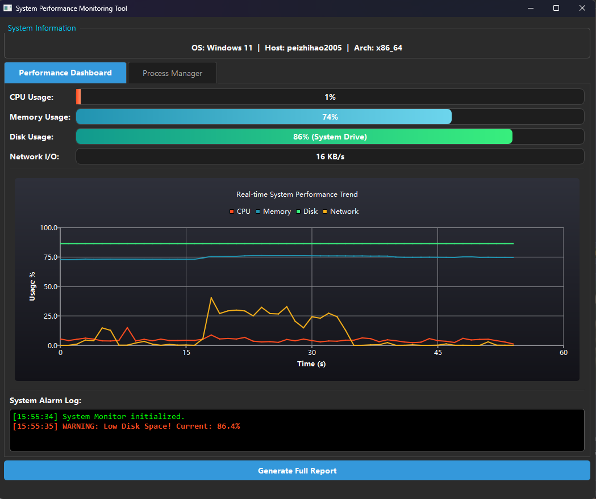
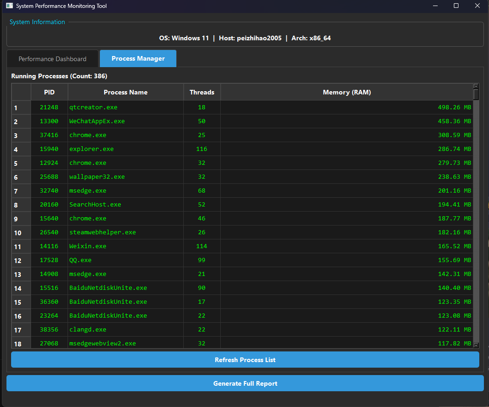

# 🖥️ Qt System Monitor (WinSysMon)

> A high-performance, real-time system monitoring tool built with **C++**, **Qt Framework**, and **Windows API**.


## 📖 Introduction

**Qt System Monitor** is a desktop application designed to provide granular visibility into system resources. Unlike standard task managers, this tool focuses on visualization and historical data tracking, featuring an "Oscilloscope-style" real-time graph and a modern "Dark Mode" UI.

It was developed as a Course Design project to demonstrate proficiency in:
- **Low-level Systems Programming** (Win32 API interaction).
- **GUI Development** (Qt Widgets & Custom QSS).
- **Data Visualization** (Qt Charts).

## ✨ Key Features

- **📊 Real-time Dashboard**: Monitors CPU usage, Memory (RAM), Disk activity, and Network speed with 60Hz refresh rate.
- **📈 Oscilloscope Visualization**: Dynamic line charts that visualize historical trends (scrolling window algorithm).
- **🌑 Modern Dark UI**: Custom QSS styling to reduce eye strain and improve aesthetics.
- **⚡ Process Manager**: 
  - Lists all active processes with PID, Thread count, and Memory usage.
  - **Smart Sorting**: Custom sorting algorithm to correctly order numeric memory values.
- **📝 Snapshot Reporting**: Generates a `.txt` system health report, identifying top resource consumers.

## 📸 Screenshots

| Dashboard View | Process Manager |
|:---:|:---:|
|  |  |

## 🛠️ Tech Stack

* **Language**: C++11 (Smart Pointers, Lambda Expressions)
* **Framework**: Qt 5.14 / 6.0 (Widgets Module)
* **Libraries**:
    * `QtCharts` (Data Visualization)
    * `Windows API` (kernel32, psapi, iphlpapi)

## 🚀 How to Build

1.  **Prerequisites**:
    * Install **Qt Creator** with MinGW (or MSVC) compiler.
    * Ensure the **Qt Charts** module is installed.

2.  **Clone the Repository**:
    ```bash
    git clone [https://github.com/YourUsername/Qt-System-Monitor.git](https://github.com/YourUsername/Qt-System-Monitor.git)
    ```

3.  **Configure Project**:
    Open the `.pro` file in Qt Creator. Make sure the following line exists:
    ```pro
    QT += core gui charts
    ```

4.  **Build & Run**:
    Click the **Run (Green Arrow)** button in Qt Creator.

## 📝 Author

* **Zhihao** (Your Name)
* Major: Computer Science & Technology
* School: China University of Geosciences

---
*This project is for educational purposes.*
